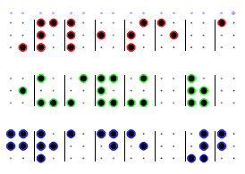
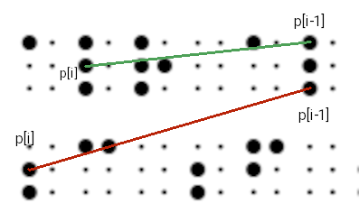

# pybraille2text
Translate braille images to text using pyhon-opencv to detect blobs.  
Status: Beta

[](https://www.paypal.com/donate/?hosted_button_id=WBY3Y35L2P7UQ)

<!-- TOC start (generated with https://github.com/derlin/bitdowntoc) -->

- [General considerations](#general-considerations)
- [Image considerations](#image-considerations)
- [Braille considerations](#braille-considerations)
- [Translation strategy](#translation-strategy)
- [Group coordinates by line](#group-coordinates-by-line)
- [Find cells representing a character](#find-cells-representing-a-character)
- [Translate cell coordinates to Braille character indexes](#translate-cell-coordinates-to-braille-character-indexes)
- [Translate dot indexes to text](#translate-dot-indexes-to-text)
- [Configuration](#configuration)
- [Tuning suggestions](#tuning-suggestions)
- [Tests](#tests)
- [Documentation](#documentation)
- [Compiling liblouis20](#compiling-liblouis20)

<!-- TOC end -->

## General considerations
The module is focused on parsing Braille cells to text from a set of keypoints returned by `opencv`. Dealing with blob detection in more complex cases is out of the scope for now.  
Code comments might provide technical details for those interested.

## Image considerations
Blob detection is sensitive to image quality so currently it's tuned for the following specs:

- white margin around dots area has an impact and should be at least 1.5 times the width/height of a character (empirical).
- If small dots are detected then the contrast should be increased.

Tuning the detection parameters can be done by setting `cv2_cfg.detect.show_detect: true` in the configuration file.
Detected dots in a line should all have the same color. Black dots without colored contour mean they were not detected. Small dots with color mean blob area
detection errors that will lead to translation errors. Some times a lot of them so it's important.

### Reference cells
The extra line of small colored dots on top of the first line represents the calculated reference cells coordinates to be used on cell detection and detection visualization. The vertical lines between cells is also another visual help to troubleshoot detection. Think of this as flattening the image and keeping a single line of all possible dots. The more lines the image has, the more accurate the reference will be. Two dots are enough to build a complete cell since vertical dot distance is equal to the horizontal dot distance, i.e. having the coordinates of dots 1,4 allows to find coordinates of dots 1,5 and 3,6.  
The size of the extra colored dots represents how the dot was generated. Smallest dots (1 px) are the original ones detected by `opencv`, other sizes from 3 to 7 are calculated coordinates dots. This line is added only to be displayed and NOT PART of the original coordinates.  
The last dot in the reference line is a calculated one and helps to translate the dot in the last cell of the first line as dot 1 and not dot 4.


## Braille considerations
Some testing samples have been generated using [ABC Braille site](https://abcbraille.com/text) 
for now but that text to Braille translation is also automated so it may contain inaccuracies leading to wrong detected text.
A few other test samples have been taken from online sites.

The translation language can be configured and passed to `liblouis20` and it has better results with Grade 2 Braille regardless of the language. Braille writing has changed over the last - say - 20 years so translating old braille could be hard to do. As an example of this issue, the text part in the [last image in this site](http://www.brl.org/transcribers/session02/quant.html) can but correctly translated but not the numeric part since it uses some abbreviations that has changed over time, e.g.: degrees symbol.
  
Sample images of real Braille pages will be mostly welcomed. :-)

## Translation strategy
In general terms

```None
Braille image --> blob coordinates --> Braille cell indexes --> Unicode Braille --> text (optional)
```

> [!IMPORTANT]
> Current project achievement is to produce 100% accurate Unicode Braille regardless of the text translation final accuracy.

- Get a sorted `numpy` array of blob coordinates from `opencv` detected keypoints.
- Group coordinates by line.
- Find cells coordinates representing a character, line by line.
- Translate cell coordinates to Braille character indexes (1,2,3 for the first column, 4,5,6 for the second).
- Translate dot indexes to Unicode Braille characters.
- Translate Unicode Braille to English text with `liblouis20` (optional).
- Translate Unicode Braille to Braille ASCII with `liblouis20` (optional).

## Group coordinates by line
Lines are detected using the coordinates differences between contiguous coordinates.  
Negative values are the key ones since they represent a row change (green line) or the start of a line (red line).

e.g.: previous point `p[i-1]=(520,69)`, current point `p[i] =(69, 140)` -> `xydiff = (-451, 71).`

```
if (x-diff is negative) and (y-diff is greater than vertical cell size):
    "current dot is starting a line"
```
    


## Find cells representing a character
Keypoints belonging to the same cell are primarily found using [reference cells](#reference-cells) and falling back to use current line coordinates/parameters if necessary.
See also: `pybrl2txt.braille_to_text.get_area_parameters`

Errors may impact just the corresponding word or the whole line.

```None
WARNING [ pybrl2txt ] WARN. cell_idx not found. Line: 0, ydot14: 35.0, ydot25: 50.0, ydot36: 66.0, idx: 24, cell_middle: 954, kp: [954.  66.]
ERROR   [ pybrl2txt ] index translation error
[[954.  35.]
 [954.  50.]
 [954.  66.]] -> (-1, -1, -1)
 ```

## Translate cell coordinates to Braille character indexes
Translate cell coordinates to dot indexes tuples like `((4, 5, 6), (3, 4, 6),)`.

Unicode Braille character names are of the form `BRAILLE PATTERN DOTS-<cell indexes>`  
e.g.: `BRAILLE PATTERN DOTS-1236  --> letter 'v'`  
so those tuples are joined to find a character: `(4, 5, 6) --> BRAILLE PATTERN DOTS-456`

There are 2 available methods for translation:

- Cell normalization (current). See: `pybrl2txt.braille_to_text.cell_keypoints_to_braille_indexes` docstrings.
- Cell coordinates computation: See: `pybrl2txt.braille_to_text.cell_to_braille_indexes_no_magic` docstrings. Also used as a fallback method if needed.

## Translate dot indexes to text
Probably the toughest part because Braille reading rules must be applied. This could imply changing Braille Grade in the middle of the translation or detecting and translating older Braille versions.  
It was decided not to write a new algorithm for now but to use `liblouis20` library instead
since it provides `python` bindings.
The result is very promising for Braille Grade 2.  
Spanish and French were tested with varying accuracy (100% French, ~ 80% Spanish).
See texts and images for those tests in `tests/resources`.
Language selection is done with `parse.lang` configuration property.

## Configuration
Yaml file as follows

```
name: abbraviations # session name
grade: 2            # Braille Grade - 2|1

cfg:
    logging_level: debug # standard logging levels or TRACE
    with_louis: text     # translation mode. One of text|ascii|braille|all|none
                         # 'text' and 'ascii' require python-louis

parse:
    lang: en-us          # keys in pybrl2txt.braille_maps
    round_to: 1          # Coordinates values rounding. Better results with 0 or 1.
    normalized: true     # Cell detection strategy. True by default and recommended.

cv2_cfg:                 # regular opencv blob detection parameters
    detect:
        min_area: 5
        max_area: 100
        min_inertia_ratio: 0.5
        min_circularity: 0.5
        min_convexity: 0.5
        min_dist_between_blobs: 5
        min_threshold: 20
        max_threshold: 50
        
    show_detect:               # show blob detection result parameters
        enabled: false         # enabled|disabled
        basic: false           # single color around blobs, no dots or lines.
        with_dots: true        # show a line of dots of reference coordinates on top of actual blobs.
        with_cell_end: true    # show a vertical line separating cells
```

## Tuning suggestions

- Start with simple Braille images having more than one line.
- If images are digitally generated with online tools, save also the text.
- Have a different yaml configuration file for each image or type of images.
- If you see too many errors then blob detection probably needs tuning. Check found blob areas  
`INFO    [ pybrl2txt ] keypoint sizes [10 11]`  
If values are not close to each other then `cv2_cfg.detect.min_area` property needs tuning, e.g.: `[4, 10, 11]`.

## Tests
A few simple tests have been added mostly for development control. Each one is supplied with the corresponding image, configuration file and plain text represented in the image. Run them as simple `python` scripts.
The test in Spanish language gives a translation with errors but `liblouis` binaries also give the same errors in command line so it might be due to library issues. 
**Note**: All test images were digitally generated or downloaded from the web.

```
# all significant tests returning Unicode Braille - default
test_all.py
```
Result sample

```None
SUCCESS: abbreviations_brl_single_line.png, lang: 'en-ueb-g2'
⠠⠁⠀⠼⠁⠚⠚⠀⠃⠊⠗⠙⠎⠀⠜⠗⠊⠧⠫⠀⠽⠑⠌⠻⠐⠙
```

```
# all significant tests returning text - python-louis required
test_all.py 'text'

# individual tests - python-louis required
test_all_abbreviations.py
test_camel_case.py
test_spanish.py
```

## Documentation
Read docstrings with

```
python3.11 -m pydoc pybrl2txt.braille_to_text
```
 
 or
  
```
python3.11 -m pydoc src/pybrl2txt/braille_to_text.py
```

## Compiling liblouis20
Some Linux distributions provide `python-louis` packages for some `python` versions but not others so it might have to be manually built.

- Install `liblouis20` at OS level since tables are needed  
e.g.:
`zypper install liblouis liblouis-data`

`sudo apt install liblouis liblouis-data`

### Building python package
Download [liblouis20 sources](https://liblouis.io/downloads/)

Build commands. It worked out of the box in my case

```bash
cd /path/to/<liblouis source>
automake
./configure
make

# build python package for your preferred python version
cd python
python3.11 -m build .

# install package
pip3.11 install dist/louis-3.32.0-py3-none-any.whl
```

